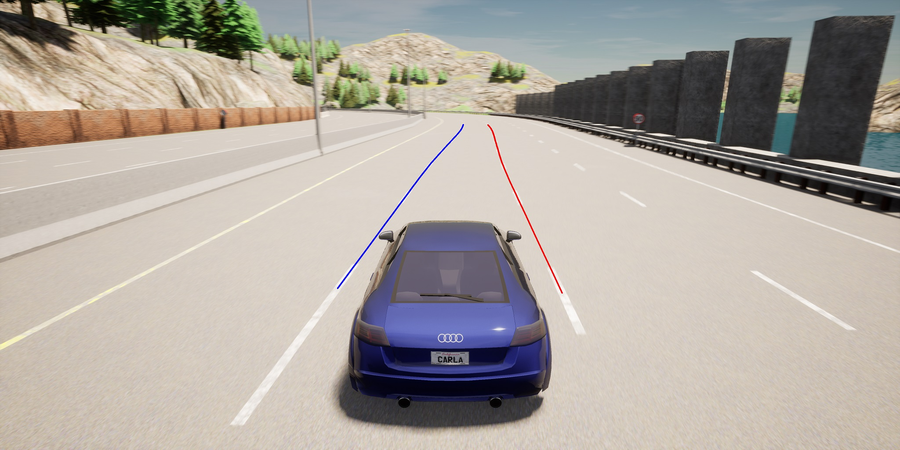

Algorithms for Automated Driving
============================

Each chapter of this (mini-)book guides you in programming one important software component for automated driving. Currently, this book contains two chapters: **Lane Detection**, and **Control**. You will implement software that 
* detects lane boundaries from an image using deep learning
* controls steering wheel and throttle to keep the vehicle within the detected lane at the desired speed

The software you will write is in python, and you will apply it in the [open-source driving simulator Carla](https://carla.org/). Ideally, your computer is powerful enough to run Carla, but if it is not, you can still work through the exercises using a simplistic simulator I created for this course. I recommend to work through the chapters in order, but each chapter is self-contained and can be studied on its own.

To work through this book, you
* should understand the following math and physics concepts: derivative, integral, trigonometry, sine/cosine of an angle, matrix, vector, coordinate system, velocity, acceleration, angular velocity, cross product, rotation matrix
* should be familiar with programming in python. In particular, you should be comfortable with multidimensional arrays in numpy.
* need to know what supervised learning is, and how to train a neural network with a deep learning framework like pytorch, fastai, tensorflow, keras, or something similar. This prerequisite is only necessary for the chapter on lane detection. If you do not fulfill it, you can skip this chapter, or study one of the [courses I recommend](../LaneDetection/Segmentation.ipynb) and then come back here.

If you find a bug in the exercise code or some confusing explanations in the book, please [raise an issue on github](https://github.com/thomasfermi/Algorithms-for-Automated-Driving). If you enjoy the book, you can make me happy by giving a star to the [book's github repo](https://github.com/thomasfermi/Algorithms-for-Automated-Driving) 😉. 

Once you finish the book or decide to stop working through it, please consider giving me some feedback by filling out [this questionnaire](https://forms.gle/TioqZiUsB5e5wSVG7) (If you open the link in your browser's incognito mode, the questionnaire should be anonymous).

Please follow this [link]() to read the book!